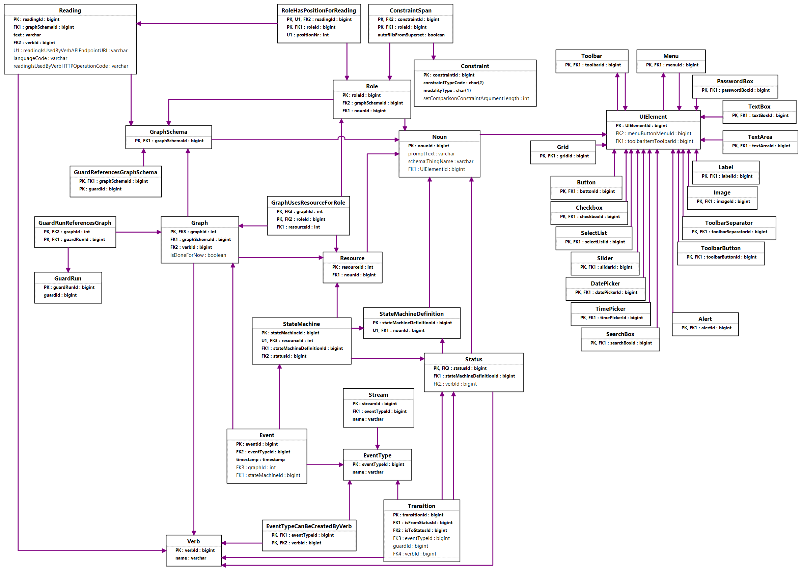
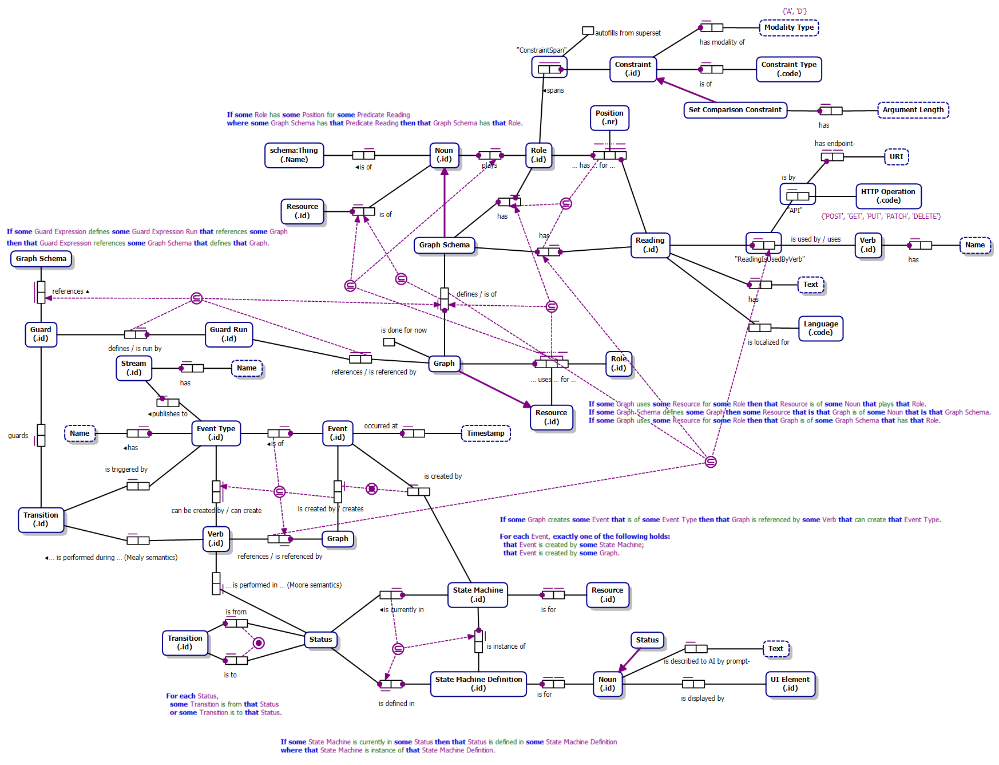

# GraphDL Server

> "Entia non sunt multiplicanda praeter necessitatem."
> (Entities should not be multiplied beyond necessity.)
> -William of Ockham

A [`Thing`](https://schema.org/Thing) metamodel with admin interface.

The GraphDL (Graph Descriptor Language) application framework provides a comprehensive Object-Role Model (ORM) framework for modeling relationships and processes, making it particularly suitable for developers, business analysts, and AIs creating e-commerce platforms, content management systems, and more. By describing the requirements for an application, then translating the description into simple sentences and abstracting out atomic fact types, the atomic fact types can be added to the GraphDL application as `Graph Schema` objects, which form a knowledge graph that can be relational-mapped into a database that stores `Graph`s in third normal form. The core components and concepts of GraphDL include:

**Graph Schemas and Graphs** `Graph Schema`s act as blueprints for how data is structured within a `Graph`. They define the `Reading`s of `Noun`s and `Verb`s.

**Readings and Roles:** Define the interactions between `Noun`s. `Reading`s with `Role`s can be thought of as the edges that connect nodes (`Noun`s), specifying the type of interaction or relationship that exists between them. `Reading`s provide the main interface for providing API definitions. When a `Reading` is accessed by an API, the `Verb`'s `Action` and the `Noun`s' `Resource`s are stored as a `Graph` that implements that `Reading`'s `Graph Schema`. `Role`s are used to define the part that each `Noun` plays in the `Graph Schema`. The number of `Role`s in a `Graph Schema` determines its arity. `Graph Schema`s can be unary, representing a checkbox or boolean field, binary, representing a value/field or relationship with another entity, or any arity higher than binary to represent a complex fact or table.

**Nouns and Resources:** Represent entities, objects, or values within the system. `Noun`s can be any subject or direct object of a sentence. They serve as the primary nodes within a `Graph Schema`, embodying the entities around which relationships are formed. When a `Graph Schema` is implemented as a `Graph`, `Noun`s are stored as `Resource` nodes in the `Graph`. A `Resource` represents a single instance of a `Noun`, such as a user, product, order, etc.

**Verbs and Actions** A `Verb` represents the relationship between two `Noun`s. It defines the type of interaction or relationship that exists between them. An `Action` is a specific instance of a `Verb` that is used in a `Graph`. This could include actions like "create", "modify", "owns", "relates to", etc.

**Statuses and Transitions:** `Status`es represent the status of an entity at a given time, and `Transition`s define how entities move from one state to another based on certain `Event`s. This is useful for modeling state machines, workflows, and processes within a system.

**Events and Guards:** These components detail the dynamics within a state machine. `Event`s trigger `Transition`s between `Status`es, and `Guard`s define conditions that must be met for `Transition`s between `Status`es to occur.

**Constraints and Constraint Spans:** Uniqueness `Constraint`s govern how entities map to a relational database schema. They span over `Role`s using `Constraint Span`s to specify the multiplicity. The `roleRelationship` field on a Graph Schema defines and interprets the `Constraint Span`s and the `Constraint`s by this pattern: One-to-many (1:\*) uniqueness `Constraint`s are part of a `Constraint Span` over only the first entity, many-to-one (\*:1) over only the last entity, many-to-many (\*:\*) over both roles, and one-to-one (1:1) is represented by two `Constraint Span`s, one for each of the roles in the graph schema.

## Generation

The data types from the fields in the database determine the UI, making it possible to generate software. UI may also be customized per entity or table. Relational database schemas and UIs can be generated using the `Generator` object.

## Visualizations

ORM2 and UML diagrams of GraphDL are included:

Open ORM model using Visual Studio 2022 with [NORMA](https://marketplace.visualstudio.com/items?itemName=ORMSolutions.NORMA2022) or explore online using <https://ormsolutions.com/tools/orm.aspx>

This repo was created by running `npx create-payload-app@latest` and selecting the "blank" template.

## Development

To spin up the project locally, follow these steps:

1. First, clone the repo
2. Then `cd YOUR_PROJECT_REPO && cp .env.example .env`
3. Next `yarn && yarn dev` (or `docker-compose up`, see [Docker](#docker))
4. Now `open http://localhost:8000/admin` to access the admin panel
5. Create your first admin user using the form on the page

Changes made in `./src` will be reflected in your app.

### Docker

Alternatively, you can use [Docker](https://www.docker.com) to spin up this project locally. To do so, follow these steps:

1. Follow [steps 1 and 2 from above](#development), the docker-compose file will automatically use the `.env` file in your project root
1. Next run `docker-compose up`
1. Follow [steps 4 and 5 from above](#development) to login and create your first admin user

The Docker instance will help you get up and running quickly while also standardizing the development environment across your teams.

### Deployment

The easiest way to deploy your project is to use [Payload Cloud](https://payloadcms.com/new/import), a one-click hosting solution to deploy production-ready instances of your Payload apps directly from your GitHub repo. You can also deploy your app manually, check out the [deployment documentation](https://payloadcms.com/docs/production/deployment) for full details.
