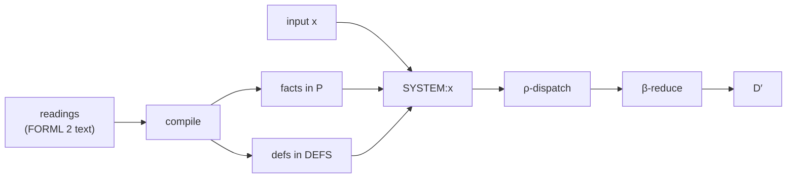

# arest

An implementation of [AREST](AREST.tex), the system described in *Compiling Facts into Applications*.

A single FORML 2 reading compiles to a database schema, a set of constraint rules, a state machine, and a REST API. The compile step is recognition rather than translation, so the reading IS the application in all four roles at once. The engine runs as a β-reducer over Backus's FFP algebra, targeting WASM today and FPGA eventually.

The design builds on [John Backus](https://en.wikipedia.org/wiki/John_Backus) (FFP/AST, 1978), [E.F. Codd](https://en.wikipedia.org/wiki/Edgar_F._Codd) (relational model, 1970), [Terry Halpin](https://en.wikipedia.org/wiki/Terry_Halpin) (ORM 2, 2008), and [Roy Fielding](https://en.wikipedia.org/wiki/Roy_Fielding) (REST, 2000).

## Hello, Order

Write this as `readings/orders.md`:

```
## Entity Types

Order(.Order Id) is an entity type.
Customer(.Name) is an entity type.

## Fact Types

Order was placed by Customer.
  Each Order was placed by exactly one Customer.

## State Machines

State Machine Definition 'Order' is for Noun 'Order'.
Status 'In Cart' is initial in State Machine Definition 'Order'.
Transition 'place' is from Status 'In Cart' to Status 'Placed'.
Transition 'ship' is from Status 'Placed' to Status 'Shipped'.
```

Compile it:

```bash
arest-cli readings/ --db app.db
```

Create an order and follow the HATEOAS link:

```bash
arest-cli "create:Order" "<<Order Id, ord-1>, <Customer, acme>>" --db app.db
# { "id": "ord-1", "status": "In Cart",
#   "_links": { "place": { "href": "/orders/ord-1/transition", "method": "POST" } } }

arest-cli "transition:Order" "<ord-1, place>" --db app.db
# { "id": "ord-1", "status": "Placed",
#   "_links": { "ship": { ... } } }
```

That is the full setup. The schema, the uniqueness constraint, the three-state machine, and the REST surface all come from the nine readings above. There is no translation step, no ORM boilerplate, and no handler registration.

## What readings compile into

| FORML 2 construct | Compiled artifact |
|---|---|
| Entity type | A relation plus its primary key (RMAP Ch. 10). |
| Fact type | A column, foreign key, or junction table, absorbed via the UC. |
| Constraint | A restriction `Filter(p) : P`, per the restrict equation. |
| State machine | A fold `foldl transition s₀ E`, per the SM equation. |
| Derivation rule | Forward-chained to the least fixed point on every create. |
| Instance fact | A row in the appropriate RMAP table plus an event that can fire an SM transition. |

Every compiled artifact becomes reachable via one named function stored in DEFS. The routing primitive is a single equation: `SYSTEM:x = (ρ(↑entity(x):D)):↑op(x)`.

## Generators

The same readings can drive multiple runtimes:

- **SQL**: DDL and triggers for SQLite, PostgreSQL, MySQL, and similar engines.
- **Solidity**: a smart contract with a typed struct, events per fact type, and a state machine modifier.
- **Verilog**: entity modules with RMAP-derived ports for FPGA synthesis.
- **iLayer / XSD / JSON Schema**: API and data-interchange surfaces.

A domain opts in by asserting `App 'myapp' uses Generator 'sqlite'` as an instance fact. Generators that are not opted in produce nothing.

## MCP server

The engine exposes a v1.0 verb set to agents via MCP.

```json
{
  "mcpServers": {
    "arest": {
      "command": "npx",
      "args": ["-y", "arest", "mcp"],
      "env": { "AREST_MODE": "local", "AREST_READINGS_DIR": "./readings" }
    }
  }
}
```

**Primitives required by the algebra:** `assert`, `retract`, `project`, `compile`.

**Entity sugar over those primitives:** `get`, `query`, `apply`, `create`, `read`, `update`, `transition`, `delete`.

**Introspection:** `explain`, `actions`, `schema`, `verify`.

**Evolution:** `propose` creates a Domain Change for governed review, and `compile` performs immediate self-modification per Corollary 5.

**LLM bridge using client sampling via MCP `createMessage`:**
- `ask` translates a natural-language question into a projection spec and executes the resulting query.
- `synthesize` takes facts plus their forward-chained derivations and produces prose.
- `validate` takes raw text, has the LLM extract facts, and runs a constraint check on them.

**ChatGPT compatibility:** the remote worker also exposes `search` and `fetch` in the shape OpenAI's apps, deep research, and company knowledge modes require. Both are thin adapters over the entity model. See [docs/09](docs/09-mcp-verbs.md#chatgpt-compatibility) for the contract.

Every framework primitive (Noun, Fact Type, Constraint, Derivation Rule, State Machine Definition, Status, Transition, Event Type, Instance Fact, Verb, Reading, External System, Agent Definition, and Generator opt-in) is reachable via these verbs. Runtime Platform functions are registered on the server and are intentionally not exposed to the LLM.

## Federation

Declare an external system as a populating function:

```
External System 'stripe' has URL 'https://api.stripe.com/v1'.
External System 'stripe' has Header 'Authorization'.
External System 'stripe' has Prefix 'Bearer'.
Noun 'Stripe Customer' is backed by External System 'stripe'.
Noun 'Stripe Customer' has URI '/customers'.
```

Federated nouns are resolved by ρ at evaluation time. Constraints and derivation rules evaluate over the unified population, and they do not distinguish local facts from federated facts. Credentials come from `AREST_SECRET_{SYSTEM}` environment variables. SSRF validation rejects internal and loopback URLs at compile time.

## Scale

At 102 entity types, 100 fact types, and 10,000 instance facts (414 KB of readings), a release build performs as follows.

| Phase | Time |
|---|---|
| parse | 575 ms |
| domain_to_state | 20 ms (O(n) confirmed) |
| compile_to_defs_state | 53 ms (2,024 defs produced) |
| defs_to_state | 39 ms |
| 1,000 fetches on D | 337 µs (0.34 µs per fetch, since Map is O(1)) |

The parser is the bulk-compile bottleneck. Per-command `create` parses single facts and is negligible.

## Architecture


```mermaid
flowchart LR
    R["readings<br/>(FORML 2 text)"] --> C["compile"]
    C --> P["facts in P"]
    C --> DF["defs in DEFS"]
    I["input x"] --> S["SYSTEM:x"]
    P --> S
    DF --> S
    S --> RHO["ρ-dispatch"]
    RHO --> BR["β-reduce"]
    BR --> D["D′"]
```

| Paper | Implementation |
|---|---|
| D (state) | A sequence or map of cells. `Object::Map(HashMap)` gives O(1) fetch. |
| P (population) | The named set of elementary facts. One cell per RMAP table. |
| S (schema) | The compiled objects in DEFS: fact types, constraints, derivation rules, and state machines. |
| ρ | A β-reducer in Rust/WASM. It compiles readings, evaluates constraints, and forward-chains derivations. |
| SYSTEM | One line of ρ-dispatch plus a state transition. There is no routing layer. |
| Platform primitives | `Func::Platform("compile")`, `Func::Platform("create:Order")`, `Func::Platform("project")`, and so on. Each is a synthesizable gate. |

## Development

```bash
# Rust engine
cd crates/arest
cargo test                                   # 400 lib tests
cargo build --release --features local       # CLI with SQLite
cargo build --release --features parallel    # opt-in Rayon for α/Filter/Construction

# WASM
cargo build --target wasm32-unknown-unknown --no-default-features --features cloudflare
cargo build --target wasm32-wasip2 --no-default-features --features wit

# TypeScript
yarn install
yarn test                # vitest
yarn typecheck
```

## Theorems

The [whitepaper](AREST.pdf) proves five properties:

1. **Grammar Unambiguity.** Each FORML 2 sentence has exactly one parse.
2. **Specification Equivalence.** Parse and compile are both injective, so the reading IS the executable.
3. **Completeness of State Transfer.** Every create reaches the least fixed point and collects every violation.
4. **HATEOAS as Projection.** Every link in the representation is a θ₁ operation on P and S.
5. **Derivability.** Every value in the representation is a ρ-application.

Self-modification preserves all five properties (Corollary: Closure). Constraint consensus enables peer-to-peer validation without an external protocol (Corollary: Consensus).

## Documentation

- [Quick start](#hello-order): the Order example above.
- [Developer docs](docs/): 10 numbered files, a self-contained reference covering the full feature surface.
- [Smart contracts](contracts/): a Foundry project that compiles, tests, and deploys the generated Solidity.
- [Whitepaper](AREST.pdf): the five theorems and their proofs.

## Status

1.0 surface complete. The core primitives, compile pipeline, state machines, generators, federation, and MCP bridge are implemented and exercised against live agents. The npm package ships as [`arest-hateoas`](https://www.npmjs.com/package/arest-hateoas), the Cloudflare Worker deploys to `https://arest.dotdo.workers.dev` with both `/mcp` and `/sse` endpoints, the Solidity generator round-trips through Foundry to a live testnet, and the [tutor](tutor/) ships seventeen lessons across three difficulty tracks.

## License

MIT
