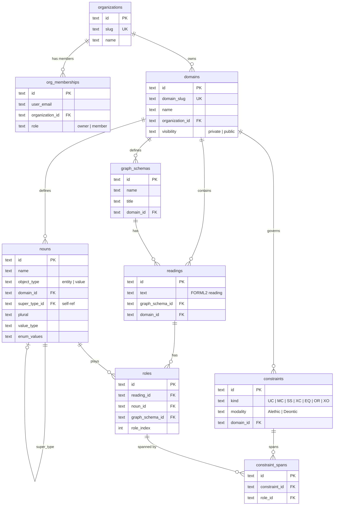
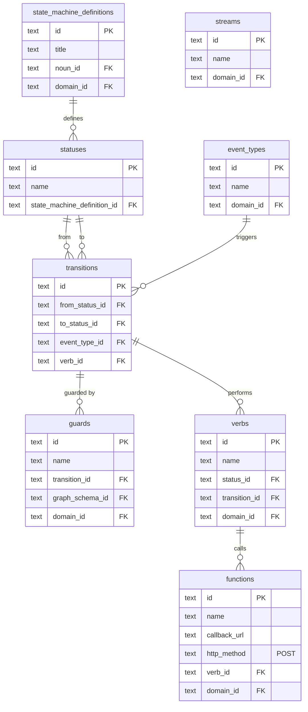
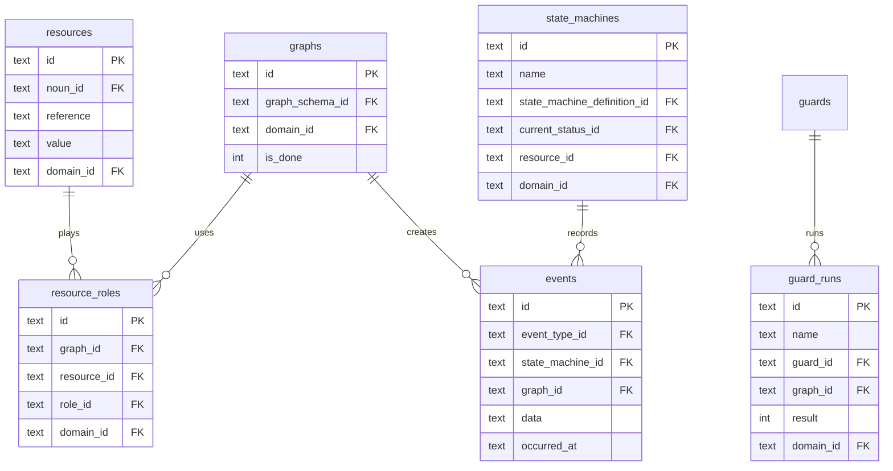

# graphdl-orm

A self-describing meta-framework for [Object-Role Modeling](https://en.wikipedia.org/wiki/Object-role_modeling) (ORM2/FORML2). Natural language readings are the source code -- they generate relational schemas, APIs, state machines, agent tools, and UI layouts.

**Stack:** Cloudflare Workers + Durable Objects (SQLite) + itty-router

## Architecture

```
readings (FORML2)
    |
    v
LLM claim extraction (/graphdl/extract/claims)
    |
    v
Claim ingestion (/claims) --> 3NF SQLite tables in Durable Object
    |
    v
REST API (/api/:collection) -- Payload CMS-compatible query language
    |
    v
Consumers: apis worker (service binding), ui.do, support agents
```

A single Durable Object (`GraphDLDB`) holds all metamodel + instance data in normalized SQLite tables. The Worker routes HTTP to the DO via itty-router. External consumers (like the `apis` worker) connect via Cloudflare service bindings -- no auth needed for worker-to-worker calls.

## Schema

### Metamodel (Knowledge Layer)

Describes *what exists* -- entity types, fact types, constraints.


```mermaid
erDiagram
    organizations {
        text id PK
        text slug UK
        text name
    }
    org_memberships {
        text id PK
        text user_email
        text organization_id FK
        text role "owner | member"
    }
    domains {
        text id PK
        text domain_slug UK
        text name
        text organization_id FK
        text visibility "private | public"
    }
    nouns {
        text id PK
        text name
        text object_type "entity | value"
        text domain_id FK
        text super_type_id FK "self-ref"
        text plural
        text value_type
        text enum_values
    }
    graph_schemas {
        text id PK
        text name
        text title
        text domain_id FK
    }
    readings {
        text id PK
        text text "FORML2 reading"
        text graph_schema_id FK
        text domain_id FK
    }
    roles {
        text id PK
        text reading_id FK
        text noun_id FK
        text graph_schema_id FK
        int role_index
    }
    constraints {
        text id PK
        text kind "UC | MC | SS | XC | EQ | OR | XO"
        text modality "Alethic | Deontic"
        text domain_id FK
    }
    constraint_spans {
        text id PK
        text constraint_id FK
        text role_id FK
    }

    organizations ||--o{ org_memberships : "has members"
    organizations ||--o{ domains : "owns"
    domains ||--o{ nouns : "defines"
    domains ||--o{ graph_schemas : "defines"
    domains ||--o{ readings : "contains"
    domains ||--o{ constraints : "governs"
    nouns ||--o| nouns : "super_type"
    graph_schemas ||--o{ readings : "has"
    readings ||--o{ roles : "has"
    nouns ||--o{ roles : "plays"
    constraints ||--o{ constraint_spans : "spans"
    roles ||--o{ constraint_spans : "spanned by"
```

### State Machine Definitions (Behavioral Layer)

Describes *how things change* -- states, transitions, guards.


```mermaid
erDiagram
    state_machine_definitions {
        text id PK
        text title
        text noun_id FK
        text domain_id FK
    }
    statuses {
        text id PK
        text name
        text state_machine_definition_id FK
    }
    event_types {
        text id PK
        text name
        text domain_id FK
    }
    transitions {
        text id PK
        text from_status_id FK
        text to_status_id FK
        text event_type_id FK
        text verb_id FK
    }
    guards {
        text id PK
        text name
        text transition_id FK
        text graph_schema_id FK
        text domain_id FK
    }
    verbs {
        text id PK
        text name
        text status_id FK
        text transition_id FK
        text domain_id FK
    }
    functions {
        text id PK
        text name
        text callback_url
        text http_method "POST"
        text verb_id FK
        text domain_id FK
    }
    streams {
        text id PK
        text name
        text domain_id FK
    }

    state_machine_definitions ||--o{ statuses : "defines"
    statuses ||--o{ transitions : "from"
    statuses ||--o{ transitions : "to"
    event_types ||--o{ transitions : "triggers"
    transitions ||--o{ guards : "guarded by"
    transitions ||--o{ verbs : "performs"
    verbs ||--o{ functions : "calls"
```

### Runtime Instances (Instance Layer)

Describes *what happened* -- concrete facts, running state machines, events.


```mermaid
erDiagram
    graphs {
        text id PK
        text graph_schema_id FK
        text domain_id FK
        int is_done
    }
    resources {
        text id PK
        text noun_id FK
        text reference
        text value
        text domain_id FK
    }
    resource_roles {
        text id PK
        text graph_id FK
        text resource_id FK
        text role_id FK
        text domain_id FK
    }
    state_machines {
        text id PK
        text name
        text state_machine_definition_id FK
        text current_status_id FK
        text resource_id FK
        text domain_id FK
    }
    events {
        text id PK
        text event_type_id FK
        text state_machine_id FK
        text graph_id FK
        text data
        text occurred_at
    }
    guard_runs {
        text id PK
        text name
        text guard_id FK
        text graph_id FK
        int result
        text domain_id FK
    }

    graphs ||--o{ resource_roles : "uses"
    resources ||--o{ resource_roles : "plays"
    state_machines ||--o{ events : "records"
    graphs ||--o{ events : "creates"
    guards ||--o{ guard_runs : "runs"
```

### CDC Event Log

Every mutation is tracked for sync and audit:

```sql
cdc_events (id, timestamp, operation, table_name, entity_id, data)
```

## API

Payload CMS-compatible REST API on all 23 collections:

```
GET    /api/:collection          -- list/find (where, limit, page, sort)
GET    /api/:collection/:id      -- get by ID
POST   /api/:collection          -- create
PATCH  /api/:collection/:id      -- update
DELETE /api/:collection/:id      -- delete

POST   /seed                     -- bulk seed (type: 'claims')
POST   /claims                   -- alias for /seed
GET    /seed                     -- stats (noun/reading/domain counts)
DELETE /seed                     -- wipe all data
GET    /health                   -- health check
```

### Query Language

Supports Payload-style `where` bracket notation:

```
/api/nouns?where[object_type][equals]=entity&limit=20&sort=-created_at
/api/readings?where[domain_id][equals]=graphdl-core&limit=50
/api/nouns?where[name][like]=%State%
```

### Collections

| Slug | Table | Layer |
|------|-------|-------|
| `organizations` | organizations | Access |
| `org-memberships` | org_memberships | Access |
| `domains` | domains | Access |
| `nouns` | nouns | Metamodel |
| `graph-schemas` | graph_schemas | Metamodel |
| `readings` | readings | Metamodel |
| `roles` | roles | Metamodel |
| `constraints` | constraints | Metamodel |
| `constraint-spans` | constraint_spans | Metamodel |
| `state-machine-definitions` | state_machine_definitions | State |
| `statuses` | statuses | State |
| `event-types` | event_types | State |
| `transitions` | transitions | State |
| `guards` | guards | State |
| `verbs` | verbs | State |
| `functions` | functions | State |
| `streams` | streams | State |
| `graphs` | graphs | Instance |
| `resources` | resources | Instance |
| `resource-roles` | resource_roles | Instance |
| `state-machines` | state_machines | Instance |
| `events` | events | Instance |
| `guard-runs` | guard_runs | Instance |

## Claim Ingestion

The `/claims` endpoint accepts structured claims extracted from natural language:

```json
{
  "type": "claims",
  "domains": [
    {
      "slug": "library",
      "claims": {
        "nouns": [
          { "name": "Book", "objectType": "entity", "plural": "Books" },
          { "name": "Title", "objectType": "value", "valueType": "string" }
        ],
        "readings": [
          { "text": "Book has Title", "nouns": ["Book", "Title"], "predicate": "has", "multiplicity": "*:1" }
        ],
        "constraints": [
          { "kind": "UC", "modality": "Alethic", "reading": "Book has Title", "roles": [0] }
        ],
        "subtypes": [],
        "transitions": [
          { "entity": "Book", "from": "Available", "to": "Checked Out", "event": "checkout" }
        ],
        "facts": []
      }
    }
  ]
}
```

The ingestion engine:
1. Creates nouns (find-or-create by name + domain)
2. Applies subtypes (sets `super_type_id`)
3. Creates graph schemas + readings + roles (auto-tokenized)
4. Applies constraints (UC, MC, etc.)
5. Seeds state machine definitions + statuses + transitions

## Bootstrap

On first boot, the Durable Object seeds the `graphdl-core` domain with 23 entity type nouns -- one per physical table plus key subtypes (Graph Schema, Status, Graph). This makes the framework self-describing: you can query the metamodel about the metamodel.

## Deployment

```bash
yarn install
yarn deploy          # deploys to Cloudflare Workers
```

Requires `wrangler` CLI and access to the Cloudflare account.

### Service Binding

Other Cloudflare Workers connect via service binding (no auth needed):

```typescript
// In consuming worker's wrangler.jsonc:
"services": [{ "binding": "GRAPHDL", "service": "graphdl-orm" }]

// Usage:
const res = await env.GRAPHDL.fetch(new Request('https://graphdl-orm/api/nouns?limit=10'))
const data = await res.json()
```

## Seeding Domains

The `scripts/seed-metamodel.ts` script reads FORML2 readings from `readings/*.md`, extracts structured claims via the LLM extraction endpoint, and seeds them into the database:

```bash
AUTO_DEV_API_KEY=your-key npx tsx scripts/seed-metamodel.ts
```

### Readings Files

| File | Domain | Content |
|------|--------|---------|
| `core.md` | graphdl-core | Nouns, readings, roles, verbs, constraints, UI elements |
| `organizations.md` | graphdl-organizations | Organizations, memberships, domain ownership |
| `state.md` | graphdl-state | State machine definitions, statuses, transitions, guards |
| `instances.md` | graphdl-instances | Graphs, resources, resource roles, state machines, events |
| `ui.md` | graphdl-ui | Dashboards, sections, widgets |

## Development

```bash
yarn dev             # local dev server (wrangler dev)
yarn test            # run tests (vitest)
yarn typecheck       # type check (tsc --noEmit)
```

## License

MIT
