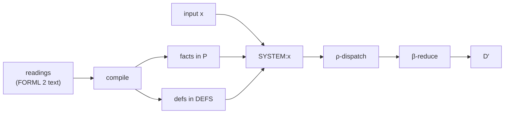

# arest

An implementation of [AREST](AREST.tex) — *Compiling Facts into Applications*.

A single FORML 2 reading compiles to a database schema, constraint rules, a state machine, and a REST API. Not a translation between representations; the reading is all four at once. The engine is a β-reducer over Backus's FFP algebra targeting WASM and eventually FPGA.

Based on [John Backus](https://en.wikipedia.org/wiki/John_Backus) (FFP/AST, 1978), [E.F. Codd](https://en.wikipedia.org/wiki/Edgar_F._Codd) (relational model, 1970), [Terry Halpin](https://en.wikipedia.org/wiki/Terry_Halpin) (ORM 2, 2008), and [Roy Fielding](https://en.wikipedia.org/wiki/Roy_Fielding) (REST, 2000).

## Hello, Order

Write this as `readings/orders.md`:

```
## Entity Types

Order(.Order Id) is an entity type.
Customer(.Name) is an entity type.

## Fact Types

Order was placed by Customer.
  Each Order was placed by exactly one Customer.

## State Machines

State Machine Definition 'Order' is for Noun 'Order'.
Status 'In Cart' is initial in State Machine Definition 'Order'.
Transition 'place' is from Status 'In Cart' to Status 'Placed'.
Transition 'ship' is from Status 'Placed' to Status 'Shipped'.
```

Compile it:

```bash
arest-cli readings/ --db app.db
```

Create an order and follow the HATEOAS link:

```bash
arest-cli "create:Order" "<<Order Id, ord-1>, <Customer, acme>>" --db app.db
# { "id": "ord-1", "status": "In Cart",
#   "_links": { "place": { "href": "/orders/ord-1/transition", "method": "POST" } } }

arest-cli "transition:Order" "<ord-1, place>" --db app.db
# { "id": "ord-1", "status": "Placed",
#   "_links": { "ship": { ... } } }
```

That's it. The schema, the uniqueness constraint, the three-state machine, and the REST surface all came from the nine readings. No translation step, no ORM boilerplate, no handler registration.

## What you get from readings

| FORML 2 construct | Compiled artifact |
|---|---|
| Entity type | Relation + primary key (RMAP Ch. 10) |
| Fact type | Column, foreign key, or junction table (absorbed via UC) |
| Constraint | Restriction `Filter(p) : P` — Eq. restrict |
| State machine | `foldl transition s₀ E` — Eq. sm |
| Derivation rule | Forward-chained to the least fixed point on every create |
| Instance fact | Row in the appropriate RMAP table, event that can fire an SM transition |

Every compiled artifact is reachable via one named function stored in DEFS. `SYSTEM:x = (ρ(↑entity(x):D)):↑op(x)` is the only routing primitive.

## Generators

The same readings can drive multiple runtimes:

- **SQL** — DDL + triggers for SQLite, PostgreSQL, MySQL, and friends
- **Solidity** — smart contract with typed struct, events per fact type, state machine modifier
- **Verilog** — entity modules with RMAP-derived ports for FPGA synthesis
- **iLayer / XSD / JSON Schema** — API and data interchange surfaces

Opt in by asserting `App 'myapp' uses Generator 'sqlite'` as an instance fact. Generators that aren't opted in produce nothing.

## MCP server

The engine is exposed to agents via MCP with a frozen v1.0 verb set.

```json
{
  "mcpServers": {
    "arest": {
      "command": "npx",
      "args": ["-y", "arest", "mcp"],
      "env": { "AREST_MODE": "local", "AREST_READINGS_DIR": "./readings" }
    }
  }
}
```

**Primitive** (algebra-required): `assert`, `retract`, `project`, `compile`

**Entity sugar**: `get`, `query`, `apply`, `create`, `read`, `update`, `transition`, `delete`

**Introspection**: `explain`, `actions`, `schema`, `verify`

**Evolution**: `propose` (creates a Domain Change for governed review), `compile` (immediate self-modification — Corollary 5)

**LLM bridge** (uses client sampling via MCP `createMessage`):
- `ask` — natural-language question → projection spec → executed results
- `synthesize` — facts plus forward-chained derivations → prose
- `validate` — raw text → LLM-extracted facts → constraint check

Every framework primitive (Noun, Fact Type, Fact Type, Constraint, Derivation Rule, State Machine Definition, Status, Transition, Event Type, Instance Fact, Verb, Reading, External System, Agent Definition, Generator opt-in) is reachable via these verbs. Runtime Platform functions are registered server-side and are intentionally not LLM-exposed.

## Federation

Declare an external system as a populating function:

```
External System 'stripe' has URL 'https://api.stripe.com/v1'.
External System 'stripe' has Header 'Authorization'.
External System 'stripe' has Prefix 'Bearer'.
Noun 'Stripe Customer' is backed by External System 'stripe'.
Noun 'Stripe Customer' has URI '/customers'.
```

Federated nouns are resolved by ρ at evaluation time. Constraints and derivation rules evaluate over the unified population without distinguishing local from federated facts. Credentials come from `AREST_SECRET_{SYSTEM}` environment variables. SSRF validation rejects internal and loopback URLs at compile time.

## Scale

At 102 entity types, 100 fact types, 10,000 instance facts (414 KB of readings), release build:

| Phase | Time |
|---|---|
| parse | 575 ms |
| domain_to_state | 20 ms (O(n) confirmed) |
| compile_to_defs_state | 53 ms (2,024 defs produced) |
| defs_to_state | 39 ms |
| 1,000 fetches on D | 337 µs (0.34 µs per fetch — Map is O(1)) |

Parser is the bulk-compile bottleneck; per-command `create` parses single facts and is negligible.

## Architecture


```mermaid
flowchart LR
    R["readings<br/>(FORML 2 text)"] --> C["compile"]
    C --> P["facts in P"]
    C --> DF["defs in DEFS"]
    I["input x"] --> S["SYSTEM:x"]
    P --> S
    DF --> S
    S --> RHO["ρ-dispatch"]
    RHO --> BR["β-reduce"]
    BR --> D["D′"]
```

| Paper | Implementation |
|---|---|
| D (state) | Sequence or Map of cells. `Object::Map(HashMap)` gives O(1) fetch. |
| P (population) | Named set of elementary facts. One cell per RMAP table. |
| S (schema) | Compiled objects in DEFS: fact types, constraints, derivation rules, state machines. |
| ρ | β-reducer in Rust/WASM. Compiles readings, evaluates constraints, forward-chains derivations. |
| SYSTEM | One line of ρ-dispatch + state transition. No routing layer. |
| Platform primitives | `Func::Platform("compile")`, `Func::Platform("create:Order")`, `Func::Platform("project")`, etc. Synthesizable gates. |

## Development

```bash
# Rust engine
cd crates/arest
cargo test                                   # 872 tests
cargo build --release --features local       # CLI with SQLite
cargo build --release --features parallel    # opt-in Rayon for α/Filter/Construction

# WASM
cargo build --target wasm32-unknown-unknown --no-default-features --features cloudflare
cargo build --target wasm32-wasip2 --no-default-features --features wit

# TypeScript
yarn install
yarn test                # vitest
yarn typecheck
```

## Theorems

The [whitepaper](AREST.pdf) proves five properties:

1. **Grammar Unambiguity** — each FORML 2 sentence has exactly one parse.
2. **Specification Equivalence** — parse and compile are injective; the reading IS the executable.
3. **Completeness of State Transfer** — every create reaches the least fixed point and collects all violations.
4. **HATEOAS as Projection** — every link in the representation is a θ₁ operation on P and S.
5. **Derivability** — every value in the representation is a ρ-application.

Self-modification preserves all five (Corollary: Closure). Constraint consensus enables peer-to-peer validation without an external protocol (Corollary: Consensus).

## Documentation

- [Quick start](#hello-order) — the Order example above
- [Developer docs](docs/) — 10 numbered files, self-contained reference covering the full feature surface
- [Smart contracts](contracts/) — Foundry project that compiles, tests, and deploys the generated Solidity
- [Whitepaper](AREST.pdf) — the five theorems and their proofs

## Status

Pre-1.0. The verb set is frozen. Core primitives, compile pipeline, state machines, generators, federation, and the MCP bridge are implemented and tested (872 tests). Remaining before 1.0: a live testnet deploy of the Solidity generator, and exercising the MCP bridge against a live agent to confirm tool descriptions and sampling work end-to-end.

## License

MIT
