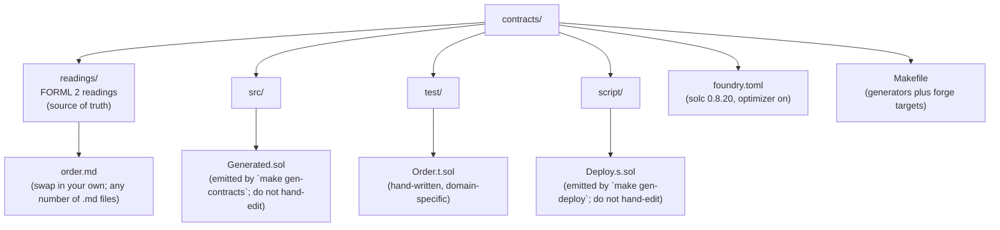

# Order Contracts

This Foundry project deploys and tests the smart contracts generated from `readings/order.md` by the AREST Solidity generator. Every contract here came from compiling FORML 2 readings, so nothing is hand-written.

## Prerequisites

Install [Foundry](https://book.getfoundry.sh/getting-started/installation) from a Unix-like shell such as macOS Terminal, Linux, WSL, or **Git Bash on Windows**. PowerShell is not supported.

```bash
curl -L https://foundry.paradigm.xyz | bash
foundryup
cd contracts
forge install foundry-rs/forge-std
```

On older Foundry versions, append `--no-commit` to the install command.

## What is here



## Bring your own domain

The shipped `readings/order.md` is an example. Point `make` at any readings directory to regenerate `src/Generated.sol` and `script/Deploy.s.sol` for your own domain:

```bash
# From contracts/
make gen READINGS=../my-app/readings

# Or drop your .md files in contracts/readings and just run
make gen
```

Every entity noun in your readings becomes a deployable contract. Every state machine becomes a set of guarded transition functions. Every constraint becomes a `require`. The deploy script lists each contract and logs its address after deployment.

## Workflow

```bash
make gen     # Rust engine compiles readings into Generated.sol + Deploy.s.sol
make build   # forge build
make test    # forge test (six tests for the Order domain)
```

When you change readings, regenerate and retest:

```bash
make gen && make test
```

If `make` is not available, the raw commands are in the Makefile as reference.

## Local deployment (Anvil)

```bash
make anvil           # terminal 1: start the local chain
make deploy-local    # terminal 2: deploy all user contracts
```

Anvil funds ten accounts with 10k ETH each. The Makefile uses the first for deploys, so no wallet setup is needed.

## Sepolia deployment

```bash
export SEPOLIA_RPC_URL='https://sepolia.infura.io/v3/...'   # or Alchemy
export PRIVATE_KEY='0xabc...'                                # wallet with Sepolia ETH
make deploy-sepolia
```

Get Sepolia ETH from a [faucet](https://sepoliafaucet.com/).

## L2 mainnets

Each target takes `{CHAIN}_RPC_URL` and `PRIVATE_KEY` from the environment. Typical gas cost for six Order operations is well under $1 on any of these networks.

```bash
# Optimism: a public-goods-funded L2 with OP Labs governance and low gas.
export OPTIMISM_RPC_URL='https://mainnet.optimism.io'
export PRIVATE_KEY='0x...'
make deploy-optimism

# Arbitrum One: the largest L2 by TVL, run by Offchain Labs plus a DAO.
export ARBITRUM_RPC_URL='https://arb1.arbitrum.io/rpc'
make deploy-arbitrum

# Polygon PoS: cheap, fast, and widely integrated.
export POLYGON_RPC_URL='https://polygon-rpc.com'
make deploy-polygon

# Linea: a zkEVM L2 from ConsenSys.
export LINEA_RPC_URL='https://rpc.linea.build'
make deploy-linea

# zkSync Era: a zk-rollup from Matter Labs.
export ZKSYNC_RPC_URL='https://mainnet.era.zksync.io'
make deploy-zksync
```

## Any other chain

```bash
export RPC_URL='https://...'
export PRIVATE_KEY='0xabc...'
make deploy
```

## What you will see after deploy

The Order contract has:

- `struct Data { string id; bytes32 status; }` for RMAP-derived storage.
- `mapping(string => Data) public records`, keyed by Order ID.
- `event OrderWasPlacedByCustomer(string indexed order, string customer)` as the fact-as-event mapping.
- `modifier onlyInStatus(string, bytes32)` for the state machine guard.
- `function create(string memory id)` for the UC check and the initial status "In Cart".
- `function place(string memory id)` to transition from In Cart to Placed.
- `function ship(string memory id)` to transition from Placed to Shipped.
- `function archive(string memory id)` to transition from Shipped to Archived.

Every transition is guarded by `onlyInStatus`. Calling `ship()` on an Order that is still In Cart reverts with "SM: wrong state".

## Round-trip the reading

To verify "the reading is the executable," compare the state machine section of `readings/order.md` to the emitted transition functions in `src/Generated.sol`. They line up one-to-one. Adding a new transition in the reading and running `make gen && make test` adds a new function automatically.

## Known limitations

- The current generator emits contracts for each entity noun separately. Cross-contract references (for example, `Order was placed by Customer`) are currently only events, and they are not yet foreign-key-style inter-contract calls.
- Deontic constraints do not yet emit `require` statements; alethic UC and SM guards already do.
- Value types (for example, `Amount`) do not get their own contract. They appear as event parameters and struct fields instead.

These are improvements on the generator itself. The Foundry project consumes whatever the generator produces, so you will get them for free when the generator improves.
